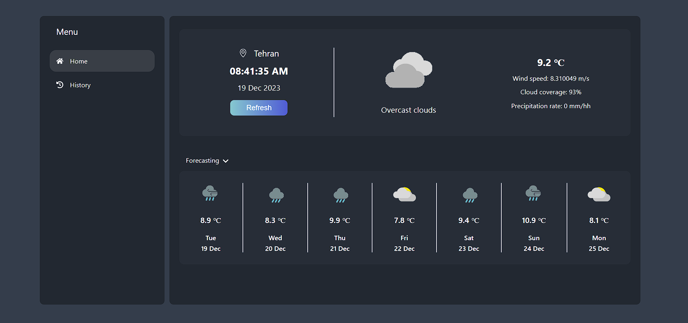

# WeatherBit App

Welcome to WeatherBit, a weather application built using Create React App and Redux Thunk for state management.

## Getting Started

These instructions will help you set up and run the WeatherBit app on your local machine.

### Prerequisites

Make sure you have Node.js and npm installed on your machine.

### Installation

1. Clone the repository to your local machine.
### `git clone https://github.com/peterrz/weather-app.git`

2. Install dependencies.
### `npm install`

3. In the project directory, you can run the following scripts:
### `npm start`

Runs the app in development mode.
Open http://localhost:3000 to view it in the browser.

The page will reload if you make edits, and you will see any lint errors in the console.

### `npm test`

Launches the test runner in interactive watch mode.
See the running tests documentation for more information.

### `npm run build`

Builds the app for production to the build folder.
It correctly bundles React in production mode and optimizes the build for the best performance.

The build is minified, and the filenames include the hashes. Your app is now ready to be deployed!
